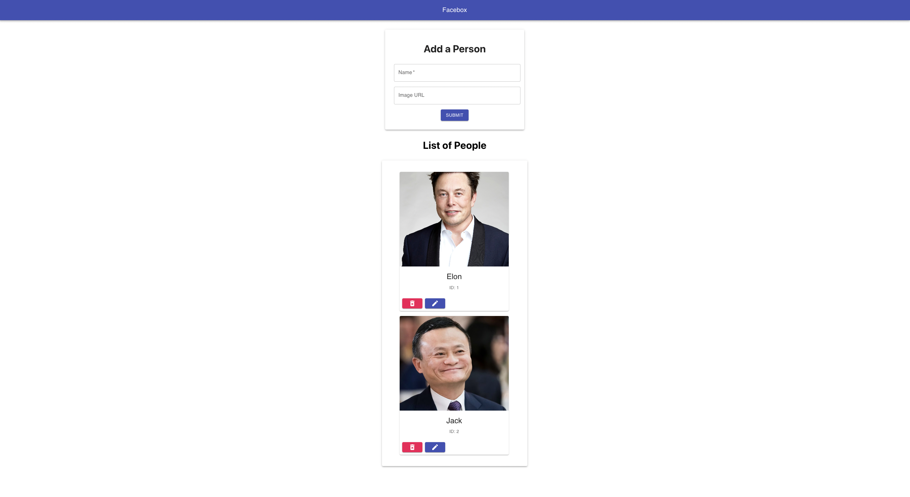

# Facebox

  

Facebox is a simple dockerised full-stack application that remembers people's names and faces. The motivation behind this project is because often times, I found it difficult to remember my friends' names and faces when meeting them for the first time, especially during orientations. This project was built with Java, Spring Boot, React.js, MySQL, Docker

## How to Use Facebox
1. Be sure to have `Docker` and `mvn` (optional) installed on your computer
2. Run `docker-compose build` then `docker-compose up` to start the frontend and database server
3. Start the backend server by using one of the two methods:
    * Use any IDE such as IntelliJ to start the application `FaceboxApplication.java`
    * Run `mvn -DskipTests clean install` then run `java -jar facebox-0.0.1-SNAPSHOT.jar`
    
4. You can now access the application at `localhost:3000` :)

## Limitation
1. There was a problem when trying to dockerise the backend server as it was not able to connect to the dockerised MySQL server. The current solution to this is to run the backend server as mentioned in Step 3 of the previous section
2. Some configurations could have been put inside an `.env` file. However, I found it slightly troublesome for users who wish to try this application and it is easier for testing purposes this way
